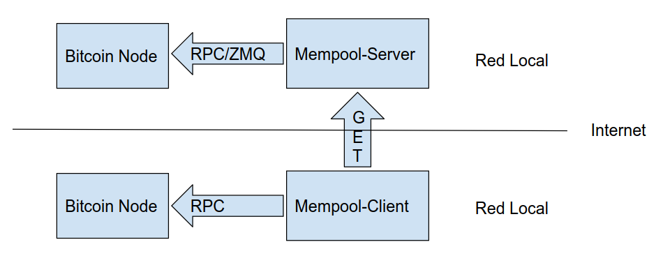

Mempool-client
==============

NOTE: This project may be deprecated by bitcoind RPC commands `savemempool` and `importmempool`.

Mempool-client is a command-line program that requests Bitcoin mempool transactions from [mempool-server](https://github.com/dev7ba/mempool-server) and injects them into a Bitcoin node.

The main purpose of mempool-server/client is to populate a newly started Bitcoin node with transactions from another mempool, bypassing the time required for the node to synchronize with the mempool. Keep in mind that there is no such thing as a global mempool, so variations between nodes are expected.

There are various reasons why you may want your Bitcoin node to have a "full mempool." For regular users, the primary reason is to be able to estimate fees independently (e.g., when using the Sparrow wallet). Additionally, if you are a miner using Stratum v2, having a "good" mempool is essential. Other reasons include managing websites like https://mempoolexplorer.com or https://mempool.space. You can also boast about the number of transactions in your mempool (but be cautious about [this](https://bitcoin.stackexchange.com/questions/118137/how-does-it-contribute-to-the-bitcoin-network-when-i-run-a-node-with-a-bigger-th)).

How does it works?
------------------

Mempool-client requests mempool transactions from Mempool-server, which are ordered by dependency depth and arrival time. This ordering ensures that transactions are not rejected due to missing parent transactions in the mempool. The transactions are then sent to a Bitcoin node in an orderly manner using the sendrawtransaction RPC. Asynchronous streams are used to send transactions to the Bitcoin node while they are being received from the server.

Mempool-server thas two endpoints: `/mempool/txsdata` and `/mempool/txsdatafrom/{mempool_counter}`. The first endpoint downloads the entire mempool up to the current moment of the query. To indicate that moment, the last mempool counter is returned along with all mempool data. The second endpoint functions similarly, but it returns mempool data from a specific mempool counter. Mempool-client repeatedly calls the second function until the received mempool counter matches the requested one. This ensures that the server and client mempools are synchronized at that point (almost, except for transaction collisions between transactions already in the node).

Please note that all transactions sent via `sendrawtransaction` to bitcoind will be unconditionally sent to all of your bitcoind peers. It is recommended to execute `mempool_client` only when bitcoind has just started.

Mempool-client connects to the Bitcoin RPC using a username and password (deprecated) or cookie authentication (default).



Usage
-----

If you are executing mempool-client in the same computer as bitcoind (like Sparrow Wallet), then you don't need any configuration: execute ``./mempool-client`` and wait "the" mempool to be transfered.

If your execute mempool-client from another computer connected to bitcoind node via local network then you have to configure two things: 

First, you must have a `config.toml` file in the same directory as your executable with contents like the following:

```
[bitcoindclient]
  # Use cookie authentication
  # cookieauthpath = "/home/my_linux_user/.bitcoin/.cookie"
  # If you use user/password authentication uncomment these lines
  user = "my_user"
  passwd = "my_password"
  # Bitcoin node ipaddr for rpc interface
  ipaddr = "bitcoind_ipaddr"
```
Second, you must configure ~/.bitcoin/bitcoin.conf to have the same user and password as before. You also need to specify bitcoind and mempool-client computer network ip addresses.
```
rpcuser=my_user
rpcpassword=my_password

[main]
rpcbind=127.0.0.1
rpcbind=bitcoind_ipaddr
rpcallowip=127.0.0.1
# Allows access to bitcoind RPC anywhere from your local network using the provided user/password.
rpcallowip=192.168.0.0/16 
```
This is a configuration similar to [Sparrow Wallet](https://sparrowwallet.com/docs/connect-node.html#remote-setup) but you don't need `server=1` to be enabled.

Compilling instructions
-----------------------

- Install [rust](https://rustup.rs/) in your system
- Clone the repository in a directory: `git clone https://github.com/dev7ba/mempool-client.git`
- Go into mempool-client directory and execute `cargo build` or `cargo build --release`. The executable will appear in `/mempool-client/target/debug` or in `/mempool-client/target/release`
- Enjoy
```
